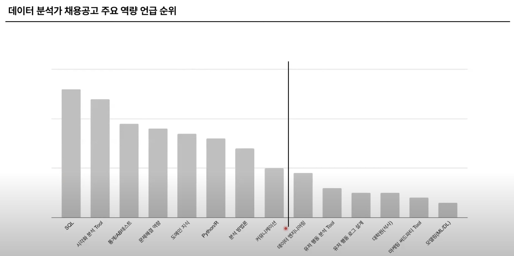

강연자 정보 : 비전공자 출신, 직무전환, 채용 면접관

# 1. 데이터 분석가에게 필요한 역량

- 기업에 대한 이해
  - 의사결정 : 원래는 사람(간부)의 감으로 진행, 요즘은 Data-driven
- 데이터분석가가 하는일
  - 문제 정의 → 데이터준비 → 데이터 분석 → 커뮤니케이션

## 문제정의

고객관점에서 이해

- 도메인 지식
- 논리적 사고
- 사용자 행동 분석 로그 설계 (기록 남기기)

## 데이터 준비

- SQL, Python, R

## 데이터 분석

- 통계지식
- 분석 방법론 (AARRR 등)
- 모델링 (ML/DL)
- 사용자 행동 분석 도구

## 리포팅

- 커뮤니케이션
- BI Tool
- PPT or Word (보고서)

# 2. 역량 개발 우선순위

## 채용공고 잘 읽어보기!

제일 많이 언급되는 SQL, 시각화툴. 내가 중요하다고 생각했던 파이썬, 모델링, 대학원 등의 문제들보다 통계, 문제해결역량, 도메인 지식이 더 많이 언급된다.

- 원티드, 사람인 같은 구직사이트 잘 활용하기
- 과거 채용 공고도 확인하기. 구글 검색, catch 같은 사이트 활용

# 3. 역량 개발 방법

통계, 문제해결,도메인지식

## 통계 지식

비전공자 기준, 통계학 전공서적 및 데이터과학을 위한 통계참고. 이것도 어려우면 더 기본적인 서적 참고.

기초통계, 추론 통계, 회귀분석, 베이즈 등등

## 문제해결 역량

문제인지 → 문제정의 → 데이터분석

- 문제 : 현상황과 목표의 Gap
  - Ex) 현재매출 → 목표매출
- 문제정의 : 문제가 왜 일어나는지 구체화하는 과정(문제 세분화)
  - 다양한 관점 (비즈니스 관점, 제품 관점…)
- 가설 기반 데이터분석 : 문제를 찾았으면
  - 가설 수립 : 이런 방법을 쓰면 문제가 해결될 것이다!

    - 구제적이고 검증 가능한 가설이어야 함
    - 검증 가능성, 리소스 비즈니스 영향 등 고려
  - 지표정의 : 가설수립 이후에 어떤 데이터를 분석할지가 보인다.

    문제해결하기 위해 검증가능한 지표를 설정

추천도서 : 데이터 문해력, 로지컬 씽킹, 가설

## 도메인 지식

- 비즈니스 관점 : 비즈니스가 어떻게 돌아가는지
  - 어떻게 제품을 만들고, 고객이 누구고, 어떻게 돈을 벌고, 비용을 어떻게 쓰고…
- 프로덕트 관점
  - 어떻게 알게되고, 어떤것에 관심을 가지고, 장바구니에 담고, 주문을 하는지

# 4. 간단한 실제 기업 사례

유튜브 출처 : [https://www.youtube.com/watch?v=L9QFkMCVTkQ](https://www.youtube.com/watch?v=L9QFkMCVTkQ)
